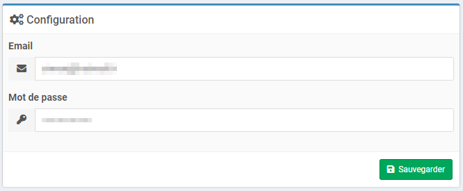

# Configuration

### Configuration du plugin

Après téléchargement du plugin, il faut l’activer, puis renseigner les identifiants dans la partie configuration du plugin.

### Configuration des équipements

Tout est importé du cloud Meross, aucune configuration d'équipement n'est nécessaire.
